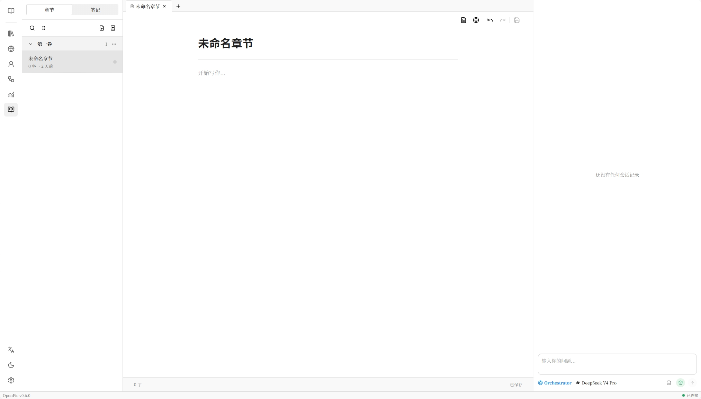

# OpenFic


中文 | [English](./README_EN.md)

**OpenFic** 是一款专为小说创作打造的跨平台、用户友好、AI Native 的一站式 Vibe Wrting 工具，构建设定、设计角色、定制工作流，让Agent适应你的写作流程，而非反之。




## 何时使用

> [!Tip]  
> *OpenFic 的设计理念是让 Agent 深度参与小说创作过程，而不是替你一键生成没有灵魂的文字，它首先是用户友好的小说写作工具，其次才是面向写作的 AI Agent 系统。*

#### 它适合这些场景：

- 正在写中长篇小说，需要长期维护世界观、角色、伏笔和章节信息
- 希望 Agent 协助你发散思路、检查前后文、补全细节
- 提供完整的设定、文风和剧情走向，希望 Agent 帮助你将灵感转化为文字
- 你有自己的写作流程，希望按需求自定义 Prompt、Agent 和工作流
- 看重本地数据保存、上下文管理和可持续的创作协作

#### 它不适合这些场景：

- 输入一句提示词，然后自动得到一整本小说，这是不切实际的
- 主要需要短篇文案、社媒内容或一次性的通用文本生成
- 你不打算维护复杂的设定信息，也不需要长期上下文和写作流程管理


## 特性

- 🚀**开箱即用**：使用 Docker 或 pip 快速安装，或是直接使用桌面版，无需复杂配置
- ✒️**专为写作打造**：面向小说写作优化和设计的编辑器，提供便捷、舒适的码字体验
- 🤝**全面的模型支持**：无缝集成来自多种提供商的模型，或是任何兼容 OpenAI API 的模型
- 📱**响应式UI**：专为多平台适配设计的界面，在桌面端、移动端和浏览器上享受无缝体验
- 🧩**定制化工作流**：高度可配置的 Agent 系统，自由的修改任何 Prompt，构建属于你的工作流
- 🤖**人机协同创作**：与 Agent 深度集成的辅助创作，发散思维、构建情节、协同编辑，而非抽卡式的一键生成
- 💾**本地持久化**：所有项目数据均保存在本地，零云存储依赖，确保隐私数据安全
- 🧠**语义化检索**：基于向量的 Agentic RAG，让 Agent 能够在百万字级别的项目中高效检索过往信息
- ⚖️**成本优先**：多层上下文管理，智能压缩、动态截断、稳定缓存，尽可能降低使用成本


## 快速开始

### 🐳 Docker（推荐）

如果使用容器方式安装进行自托管是推荐的安装方式。

```bash
docker run -d -p 8000:8000 -v "openfic:/data" --name openfic ghcr.io/syrizelink/openfic:latest
```


### 🐍 Python pip

> [!Warning]  
> 在开始前，确保你已经安装了Python3.12+

#### 1. 安装OpenFic

```bash
pip install openfic
```

#### 2. 启动服务

```bash
openfic serve
```


### 🖥桌面应用 (实验性)

> [!Warning]  
> 桌面版仍不稳定，可能存在未知问题，并且暂不支持自动更新

前往 <https://github.com/syrizelink/OpenFic/releases> 下载桌面应用，在你的系统上原生运行，而无需额外步骤。

## 贡献

欢迎提交任何形式的贡献！如果你有想法、建议或代码改进，欢迎提交 Issue 或 Pull Request。

- **报告 Bug**：如果你发现了任何问题，请在 Issues 中描述详细情况
- **提出功能需求**：有更好的功能想法？在 Issues 中分享你的需求
- **提交代码**：Fork 本仓库，修改代码后提交 Pull Request

查看 [CONTRIBUTING.md](./CONTRIBUTING.md) 获取详细的贡献指南。


## 许可证

[Apache License 2.0](https://www.apache.org/licenses/LICENSE-2.0)