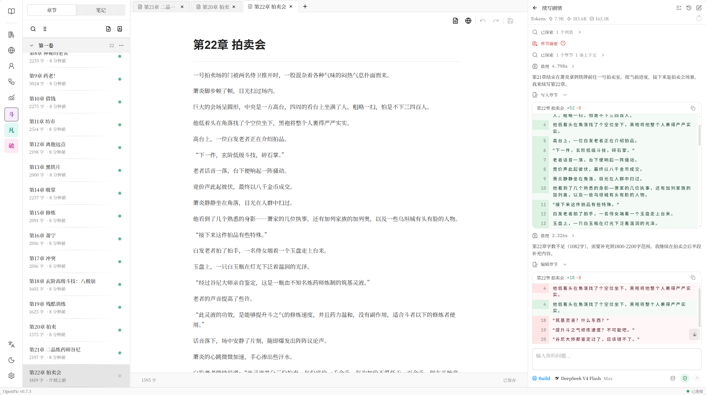

# OpenficID


Bahasa Indonesia | [English](./README_EN.md) | [中文](./README_ZH.md)

**OpenficID** adalah fork dari [OpenFic](https://github.com/syrizelink/OpenFic) yang dilokalkan ke Bahasa Indonesia. Ini adalah alat Vibe Writing lintas platform, ramah pengguna, dan AI Native untuk penulisan novel: bangun latar dunia, rancang karakter, atur alur kerja sendiri, dan buat Agent menyesuaikan diri dengan proses menulis Anda, bukan sebaliknya.



## Perbedaan dengan repo asal

- Antarmuka Bahasa Indonesia penuh: 1994 string frontend dan 210 string desktop diterjemahkan
- Bahasa default aplikasi adalah `id`, dengan English dan 简体中文 tetap tersedia sebagai opsi
- Format waktu relatif memakai locale Indonesia dari date-fns
- Pengaturan bahasa default di backend juga mengikuti `id`

## Kapan cocok dipakai

> [!Tip]
> *OpenFic dirancang agar Agent terlibat mendalam dalam proses penulisan novel, bukan menghasilkan teks tanpa jiwa dalam sekali klik. Ini pertama-tama alat menulis novel yang ramah pengguna, baru setelah itu sistem AI Agent untuk penulisan.*

#### Cocok untuk situasi ini:

- Sedang menulis novel panjang dan perlu merawat latar dunia, karakter, foreshadowing, serta informasi bab dalam jangka panjang
- Ingin Agent membantu mengembangkan ide, memeriksa konsistensi antarbab, dan melengkapi detail
- Anda menyediakan latar, gaya bahasa, dan arah cerita, lalu ingin Agent membantu mengubah inspirasi menjadi tulisan
- Anda punya alur kerja sendiri dan ingin menyesuaikan Prompt, Agent, dan alur kerja sesuai kebutuhan
- Anda mengutamakan penyimpanan data lokal, manajemen konteks, dan kolaborasi menulis yang berkelanjutan

#### Tidak cocok untuk situasi ini:

- Memasukkan satu kalimat prompt lalu berharap langsung mendapat satu novel utuh, itu tidak realistis
- Kebutuhan utamanya adalah copy pendek, konten media sosial, atau pembuatan teks umum sekali pakai
- Anda tidak berencana merawat informasi latar yang kompleks dan tidak butuh manajemen konteks maupun alur kerja penulisan jangka panjang

## Fitur

- 🚀**Langsung pakai**: Pasang cepat lewat Docker atau pip, atau langsung pakai versi desktop tanpa konfigurasi rumit
- ✒️**Dirancang untuk menulis**: Editor yang dioptimalkan untuk penulisan novel, memberi pengalaman mengetik yang nyaman
- 🤝**Dukungan model luas**: Terintegrasi mulus dengan model dari berbagai penyedia, atau model apa pun yang kompatibel dengan OpenAI API
- 📱**UI responsif**: Antarmuka multiplatform yang nyaman di desktop, perangkat mobile, maupun peramban
- 🧩**Alur kerja kustom**: Sistem Agent yang sangat bisa dikonfigurasi, ubah Prompt apa pun untuk membangun alur kerja Anda
- 🤖**Kolaborasi manusia dan AI**: Penulisan berbantuan yang terintegrasi dengan Agent untuk mengembangkan ide, menyusun plot, dan menyunting bersama
- 💾**Persistensi lokal**: Semua data proyek disimpan secara lokal, tanpa ketergantungan penyimpanan cloud
- 🧠**Pencarian semantik**: Agentic RAG berbasis vektor agar Agent dapat menelusuri informasi lampau pada proyek berjuta kata
- ⚖️**Hemat biaya**: Manajemen konteks berlapis dengan pemadatan cerdas, pemotongan dinamis, dan cache stabil

## Mulai Cepat

### 🐳 Docker (disarankan)

Pemasangan berbasis kontainer adalah cara yang disarankan untuk self-hosting.

```bash
docker run -d -p 8000:8000 -v "openfic:/data" --name openfic ghcr.io/syrizelink/openfic:latest
```

### 🐍 Python pip

> [!Warning]
> Sebelum mulai, pastikan Python 3.12+ sudah terpasang.

#### 1. Pasang OpenFic

```bash
pip install openfic
```

#### 2. Jalankan layanan

```bash
openfic serve
```

### 🖥 Aplikasi desktop

Untuk membangun versi desktop dari fork ini:

```bash
cd desktop
pnpm install
pnpm build
```

Rilis resmi upstream tersedia di [Release Page](https://github.com/syrizelink/OpenFic/releases).

## Kontribusi

Kontribusi dalam bentuk apa pun dipersilakan. Jika Anda menemukan terjemahan yang kurang tepat atau punya usulan perbaikan, silakan buka Issue atau Pull Request.

- **Laporkan bug**: Jelaskan detail masalahnya di Issues
- **Usulkan fitur**: Bagikan kebutuhan Anda di Issues
- **Perbaiki terjemahan**: Sunting `frontend/src/i18n/locales/id.json` atau `desktop/src/ui/locales/id.json`, jaga agar strukturnya tetap sama dengan `en.json`

## Penghargaan

- [OpenFic](https://github.com/syrizelink/OpenFic) - proyek asal fork ini
- [SillyTavern](https://github.com/SillyTavern/SillyTavern) - sumber inspirasi
- [oh-story-claudecode](https://github.com/worldwonderer/oh-story-claudecode) - referensi Skill penulisan bawaan

## Lisensi

[Apache License 2.0](https://www.apache.org/licenses/LICENSE-2.0)
